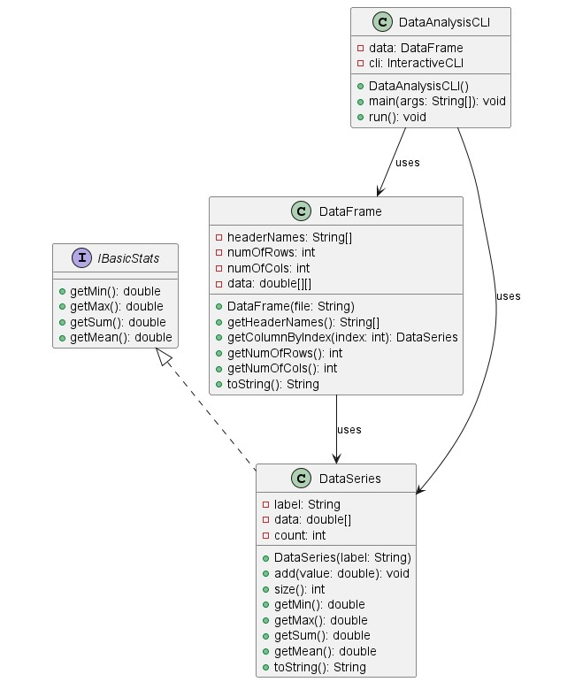
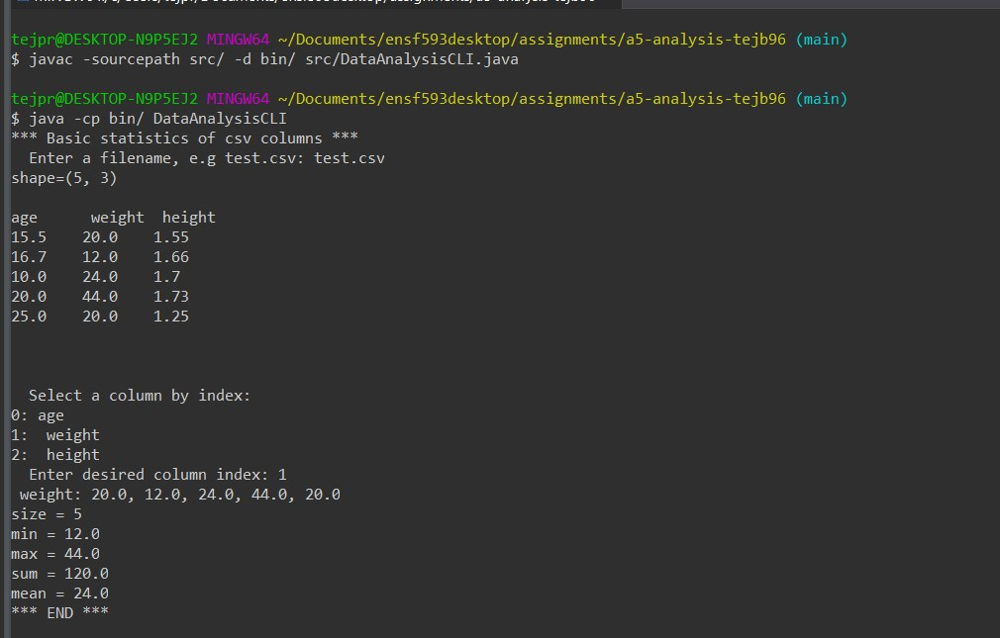
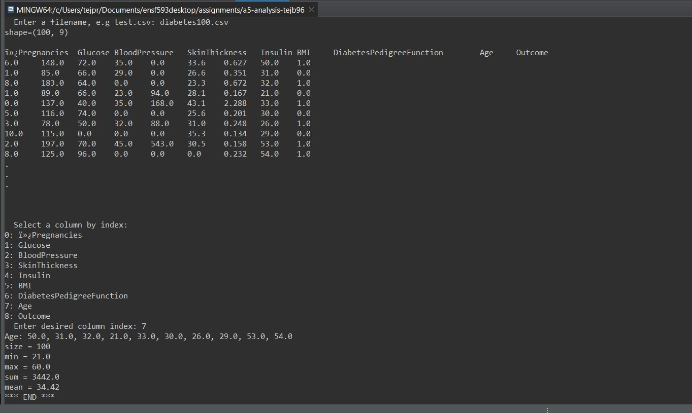
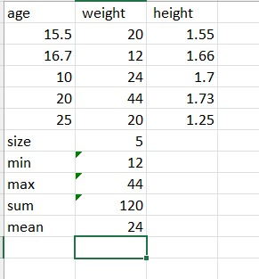

# Data Analysis report
Author: Tej B

## UML class diagram

## Execution and Testing

## Verification of statistics
The results for both diabetes100.csv and test.csv were verified using MS Excel. The files containing Excel formulas are included as diabetes100Check.csv and testCheck.csv.

# Reflection

I liked that this time I got to implement the GUI for textAnalyzer. The data analysis section was a bit difficult since I didn't understand how to implement the getColumnByIndex method initially.